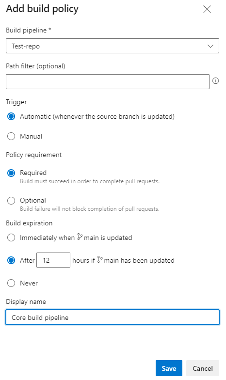
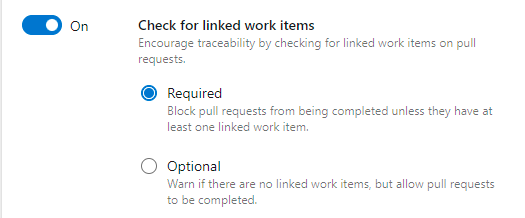
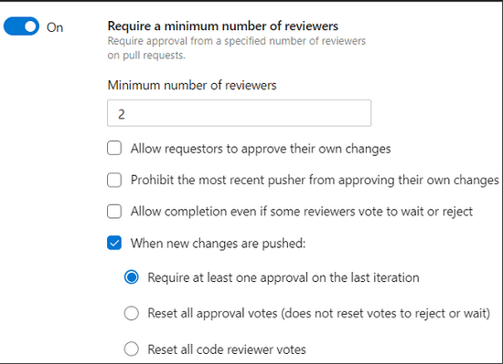
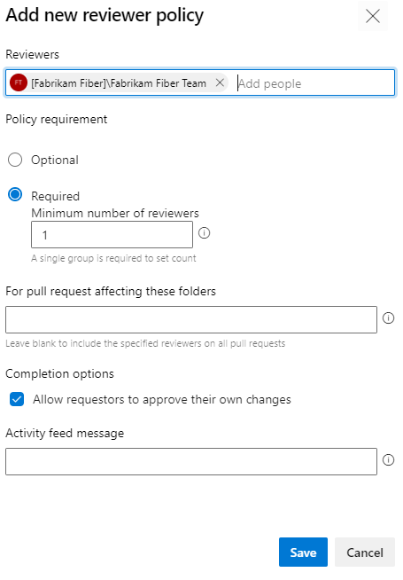
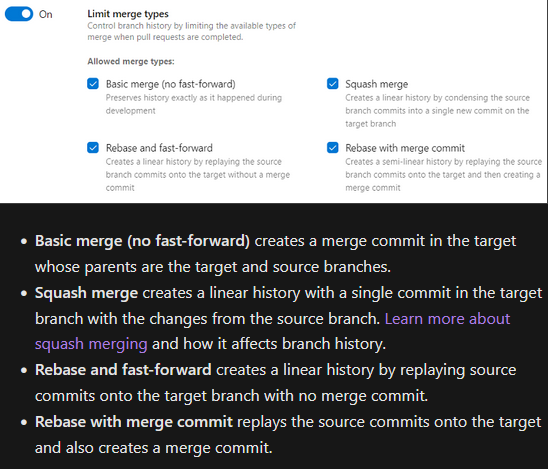
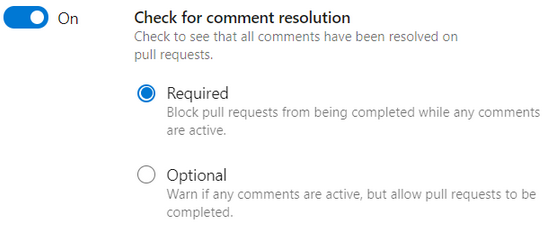
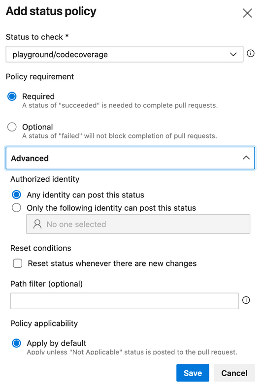

<a id="readme-top"></a>

<!-- 
Status

This write-up has several sections still 'under construction'. 
This is largely due to a related effort to establish a locally hosted linux based environment for testing related GHA workflows and specific scripts for the OpenSCAP functionality, in hopes to include additional information from that effort.
-->


<!-- Shields Section -->
[![LinkedIn][linkedin-shield]][linkedin-url]

<div align="center">
    <h1 align="center">Continuous Integration for Containerized Applications with Docker</h1>
    <p align="center">
        Guideline to pursue SDLC best practices while preparing for CI best practices when maintaining custom docker images for containerized application development. Also includes considerations for leveraging OpenSCAP implementation within a GHA workflows, with reference to a related write-up by <a href="https://candrews.integralblue.com/2023/09/scap-security-and-compliance-scanning-of-docker-images-in-github-actions-and-gitlab-ci/#implementation">Craig Andrews.</a>
</div>


<!-- TABLE OF CONTENTS -->
<div>
    <details>
    <summary>Table of Contents</summary>
    <ul>
        <li>
        <a href="#overview">Context Overview</a>
        <ul>
            <li><a href="#image b&p">CI for Docker Image Build/Push</a>
            <ul>
                <li><a href="#image b&p base func">Base Functionality</a></li>
                <li><a href="#image b&p better frame">A Better Framework</a></li>
                <li><a href="#image b&p pipe trigger">Trigger on Push with Filtering Considerations</a></li>
                <li><a href="#image b&p scans">Utilization of Container Scan/Testing steps in the 'feature push' pipeline</a></li>
                <li><a href="#image b&p perms">Granular Pipeline Permissions</a></li>
            </ul>
            </li>
            <li><a href="#app b&ut">Application Build & Unit Testing Considerations</a></li>
            <li><a href="#branch policy">Branch Policy Considerations</a></li>
        </ul>
        </li>
    </ul>
    </details>
</div>


<h1 align="center">Overview <a id="overview"></a></h1>

At a high level, the primary focus of this conversation is to target creating CI pipelines that will allow us to rapidly achieve build and push functionality for custom docker images. In addition to this, we want to ensure that these efforts start with considerations for long-term best practices to bake in mature CI/CD practices into development workflows as early as possible. Ideally we can endeavour to avoid the all too common enterprise maturation growth pain that is fully refactoring a CI/CD footprint and practices that were implemented early on when rapid product releases were prioritized over all else.

This conversation also builds towards the use of Docker and VMs for containerized development/deployment 'nodes' to be utilized as environments during the SDLC. I cover how we can leverage these resources within CI/CD to ensure consistent deployment target environments as we look to deploy containerized applications to these environments leading to production environments. This will leverage Docker in Docker (DinD) and Kubernetes in Docker (KinD) at the environment level.

This article is by no means a fully comprehensive conversation on included or mentioned topics. In the future, additional write-ups and resources will be provided as they become available.

<!-- 

A brief list of considerations for CI pipeline topics is provided here for now, with expectations of additions in the future:

 - Image Build: build and push to registries, covering best practices for security, scanning, fingerprinting, private registries
    - Security scanning/hardening
        - Docker Bench
        - SCAP Considerations
    - Monitoring
        - Prometheus/Grafana integrations
    - Orchestration Considerations
        - kubectl & Helm for k8s orchestration
        - Compose
        - Swarm 
 - Conversation on application build & unit testing
 - Branching policies to ensure all security requirements are met before merging into shared contexts
 - ADO specific considerations
    - repos
    - branches
    - permissions
    - Azure container related offerings (application level vs environment level conversation)
 

 -->


<p align="right">(<a href="#readme-top">back to top</a>)</p>


<h2 align="center">CI for Docker Image Build/Push<a id="image b&p"></a></h2>

- Image Build: build and push to registries, best practices for security, scanning, fingerprinting, private registries
    - Security scanning/hardening
        - Docker Bench
        - Docker SCAP (not a trivial or universal solution)
        - Docker Scout
    - Monitoring
        - Prometheus Considerations, other similar vendors
        - Vis. with Grafana 


### Base Functionality <a id="image b&p base func"></a>

At it's core, a CI pipeline for custom docker images should ensure that the dockerfile is built to update the image with any changes from recent development actions, and push the resultant image to a known registry.
This sort of basic pipeline can be easily and quickly set up within GitHub Actions and Azure Devops. The actions for each provider are included below:
- GHA:
    - docker/login-action@v3
    - docker/setup-buildx-action@v6
    - docker/build-push-action@v6
- ADO:
    - Docker@2
If adhering to best practices was that simple, everyone would do it. So let's expand the needs of these basic CI scenarios to create more mature pipelines.

<p align="right">(<a href="#readme-top">back to top</a>)</p>


### A Better Framework<a id="image b&p better frame"></a>

Let me start this sections by acknowledging the write up on SCAP integration into CI processes by [Craig Andrews.](craig-andrews-scap-writeup)
Not only does Craig's write-up contain excellent information, we can also map the situation we are addressing to the use-case of his work quite well. Since we seek to solve as general a use case as possible, leveraging linux-based execution environments within GHA and ADO will yeild maximum coverage when looking to leverage SCAP in particular.

One consideration that can be taken at the start of this process is that we can leverage multiple CI pipelines to own different parts of this stage of the process. This isn't a mandatory design choice, but it's something that can allow for more precise process controll down the road.

Some quick improvements we can make to this image build pipeline include the following consideration points:
- Trigger on push 
    - We want to leverage an early stage of the development workflow to kick off testing, scanning, etc. to ensure that we can support merge requirements when we are considering merging 'completed' code to the collaboration branch.
- Utilization of container scan/testing steps in the 'feature push' pipeline
    - Docker Bench
    - Docker SCAP (not a trivial process)
    - Docker Scout
    - Executing contained unit tests within the application/docker image
- Distinct processes for requirements management on merge request into collaboration branch
- Using build packages with standardized names
- Consideration for multiple CI pipelines for different stages of the process
    - We can consider a design that has multiple pipelines or independent stages of functionality that trigger at different parts of the development workflow and codebase management processes to isolate responsibilities in the CI process and allow for more precise control
        - Examples:
            - CI on Push to feature branches
                - Instigates test, scan, style standards, etc. pass/fail with feed back
                - Injection point for pre-commit/pre-push functionality
            - CI on merge request to collaboration branch
                - Validation that all requirements have passed
                - Allows for specific use-case considerations to be prioritized 
                    - SCAP scans for industry specific compliance
    
*Note:* For the following sections, we presume that the CI environment is configured correctly to allow for any mentioned additional utilities to be utilized. Additional conversation on setting up this or similar CI environments to follow.

<p align="right">(<a href="#readme-top">back to top</a>)</p>


### Trigger on Push with Filtering Considerations <a id="image b&p pipe trigger"></a>

```
on:
  - push
```

The trigger filter can be as simple as the above if we want to ensure this pipeline runs for any push actions in the repository. There are always more options for creating more specific filters for something like feature branches and other conditional situations. Those can be accomodated as the project evolves, but for now a broader net at this step of the pipeline is a good starting configuration.

If the CI/CD process is later segmented to include distinct pipelines or workflows for the container/orchestration files vs the codebase itself, then filtering would play a key role in ensuring that any given CI/CD pipeline targets the elements of the codebase it is intended for.

A quick example of this:
 - Established patterns for standardized feature branch naming patterns 
    - feature/dockerfile_*app-name*_*work-item*
 - Established Dockerfile directory patterns
    - Dockerfiles are always placed at the root directory
        - ```/Dockerfile ```
        - Potential configuration:
            - ``` 
                on:
                    push:
                        paths:
                        - Dockerfile
              ```
    - Dockerfiles are placed within a known directory
        - Potential configuration:
        - ```/Docker/Dockerfile```
            - ``` 
                on:
                    push:
                        paths:
                        - Docker/**
              ```
 

<p align="right">(<a href="#readme-top">back to top</a>)</p>


### Utilization of Container Scan/Testing steps in the 'feature push' pipeline  <a id="image b&p scans"></a>
 
 Under Construction
 - Leverage Docker Bench
    - optimizing the script
 - Leverage SCAP steps for security hardening
 - Leverage Docker Scout for scanning, considerations on usage scenarios

 <p align="right">(<a href="#readme-top">back to top</a>)</p>


### Granular Pipeline Permissions  <a id="image b&p perms"></a>

Under Construction

- Limit permissions for the pipeline jobs etc. to support least-priviliges

GitHub Actions Packages permissions:
    - packages: write
        - can upload and download this package; can read and write package metadata
    - security-events: write # per candrews: for github/codeql-action/upload-sarif to upload SARIF results
        - 
    - actions: read
        - 


<p align="right">(<a href="#readme-top">back to top</a>)</p>


<h2 align="center">Application Build & Unit Testing Considerations<a id="app b&ut"></a></h2>

### Overview

The high level goals of this area of CI support are to ensure that the codebase is able to successfully build, pass all included unit tests, and pass any static/dynamic code scanning utilities leveraged by the project. 

*Note* The scanning elements of this process are external to the application docker container and any development/test environment. 

Let's consider a simplified (not comprehensive) example of a docker container that leverages multi-stage builds to target the following stages:
- Development Build
- Development Unit Test
- Development Push Stage
- Live Push Stage

```
# syntax=docker/dockerfile:1

### Dev and live base images for situation where best practices have specific base images for each use
FROM dev_base_image AS dev_base
FROM live_base_image AS live_base

### build from the dev_build image
# Dev Build Stage
FROM dev_base AS dev_build
-- build actions

### Execute units tests leveraging development base image
# Dev Test Stage
FROM dev_base AS dev_test
-- copy files from build and execute included unit tests

### Start-up elements from development build after testing 
# Development Push Stage
FROM dev_build AS development
-- copy files from build for development stage

### Start-up elements from tested build stage in specified live image
# Live Push Stage
FROM live_base AS live
-- copy files from build for live stage
```

When we look to leverage the above docker file as a part of a CI process, we can target the specific 'dev_build' and 'dev_test' stages to distinctly target and support our build and test functionality. 
This will ensure that related branch policies as well as independent testing and scanning requirements are fulfilled by a consistent version of the application. We can additionally add to the functionality contained within the dockerfile to support code coverage, static & dynamic code scanning, and other functionality as required. 

### Application Testing

Leveraging any included unit tests for a containerized application will inherently be tech stack dependent, but there are some universal goals we can target for this process.

#### Running Unit Tests Multiple Times During CI

Why? In short, we can look at executing included unit tests for an application to ensure the application itself passes as well as executing the same tests within the container to ensure no environmental issues are missed.

The implementation of this tactic should be motivated by ensuring that the application itself is thoroughly tested by any included or available unit tests, and that any differences in performance or behavior of the application are caught by unit testing the application within a container that aligns with those utilized for development collaboration stages (DEV, INTG etc.) as well as the UAT, PROD, and TRNG environments as leveraged by the project. There will be some differences in required considerations between different development stacks, as some technologies have best practices or vendor recommendations that specific base container images be used for development and similar lower environments versus PROD or live environments (e.g. .NET).

Ideally we can imagine a development workflow that has a developer execute available unit tests locally as a part of their process to merge changes to their feature branch, with merge and PR policies and triggers in place to execute the same or an expanded bank of unit tests (as available) against the updated image before allowing the PR to be completed. 

Quick example of GHA workflow triggers for this purpose:
```
on:
  push:
    branches:
      - feature-branch/*
  pull_request:
    branches:
      - feature-branch/*
      - develop
```

More specific triggers could be included for workflow jobs that target tests included in the application code base, or others as needed. Within those jobs we can also look to test the resultant image in isolation, or as it integrates with the exising available project infrastructure or code base. Leveraging environment specific configurations, parallelized testing, workflow strategies, will also enhance the testing coverage while minimizing the possibility for differences seen in results between utilized environments. 

There are also decisions to be made on actions these being executed by jobs within larger workflows, or separate workflows that are called by a driving workflow. Earlier organizations will likely start with the former, progressing to the latter as their DevOps process matures.


### Scanning 

Incomplete dynamic/static scanning utility list:
 - Trivy
 - Crype
 - Clair
 - Bench
 - InSpec
 - Qualys
 - ```openscap-docker```
 - Azure/AWS integrated features


<p align="right">(<a href="#readme-top">back to top</a>)</p>


<h2 align="center">Branch Policy Considerations<a id="branch policy"></a></h2>

At a high level, the below list of configurations for branch policies should be considered when establishing a secure ADO repository. Establishing these policies will ensure that proposed merges are reviewed to completion, validated via build/test/scan procedures, don't allow destructive merge types, and stay connected to agreed upon work for a given work/sprint cycle. The finer details of these choices should be decided by the organizational leadership and engineering/cloud/security leadership for the platform in question. Finer details will be mentioned but not explored in depth.

- Build Pipeline Validation
- Linked Work Items
- Minimum Number of Reviewers w/ Resolution
- Automatically Included Reviewers
- Merge Type Limits/Selections
- Comment/Feedback Resolution
- Status Checks
- Path Filtering
- Bypassing Branch Policies

#### Build Pipeline Validation

ADO supports the creation of 'build validation policies' to be referenced as a part of the PR process. Simply put, they reference a specified build pipeline, a trigger, a policy requirement, and a build expiration. This will allow a given PR to ensure that the selected build pipeline completed successfully, and that said build validation isn't stale. It is within the specified build pipeline that the specific elements of building, testing, and scanning will be engineered. 



<p align="right">(<a href="#readme-top">back to top</a>)</p>

#### Linked Work Items

This branch policy is very straightforward with numerous potential benefits. This ensures that no PR can be completed without a linked sprint work item. This support more formalized development practices, and ensures that agile best practices are represented in the SDLC within ADO.



<p align="right">(<a href="#readme-top">back to top</a>)</p>

#### Minimum Number of PR Reviewers:

In short, any changes in a proposed PR should not just be validated via automated build/test/scan procedures, but also by peer developers on the related development team. This procedure has become subject to new conversations with advancements in AI regaring the capabilities and expertise that can be baked into automated processes, and that line of thought certainly has merit. However, I argue that something that can't be automated away is a redundant understanding of the changes to a living codebase by the engineering team that is responsible for it. There are other soft benefits to having HitL PR review practices, but in short, it is still widely considered a best practice to establish a minimum peer count for PR reviews based on the needs and capacity of the engineering team that owns the related development process. 

For ADO, this configuration is quick to set up for given branches in a repository. I reccomend this setting for the collaboration branch (develop) and live branch (main/master) to ensure efficient development efforts in feature branches, and thoroughly reviewed code in any shared or operational branches.

There are several additional configurations that can be set for this requirement within ADO, included in the screen grab, and these are items that should be resolved by higher level security discussions as mentioned above. These decisions will likely be driven by the nature of the development effort, and development/business use case of the repository/engineering team (a POC repository for example).



<p align="right">(<a href="#readme-top">back to top</a>)</p>

#### Automatically Included Reviewers

Building off of the previous policy, you can also maintain a list of automatically included reviewers branches within an ADO repo. In practice, I suggest utilizing an ADO project team that contains the desired members that should be represented on every pull request. This may not be a necessary policy depending on the size of the projet or organization, and is to the discretion of the project leadership. If it is desired, leveraging a specific set of these required PR reviewing members can be very handy in ensuring this policy is enacted correctly.

Below is a screen shot fo the reviewer policy blade.



<p align="right">(<a href="#readme-top">back to top</a>)</p>

#### Merge Type Limits/Selections

In my experience, the largest and most consistent benefit of this policy is that you greatly reduce the likelihood of inconsistent branch history in a given repository. Once again, the choices made on which merge types are allowed is a decision left to leadership, but in general making consistent choices for this policy will help solidify the stability of a given branch within a repository. I typically select squash merges only for collaboration and live branches to simplify the branch history, and not allow rebasing actions to break the common history between the collaboration and live branches. For situations where a large number of engineers are contributing to  a single repository, squash merges can introduce issues as there could possibly be multiple true bases for the repository. 

The below screen shot includes the UI with MSFT provided descriptions of each option:



<p align="right">(<a href="#readme-top">back to top</a>)</p>

#### Comment/Feedback Resolution

Another quick configuration with potentially massive downstream impact. This will ensure that any active conversations aren't left unresolved when a PR is completed. Maintaining efficiency in this process really depends on the engineers involved in the conversation. I have typically leveraged dedicated time through a given day for PR reviews to ensure that no comments are left unresolved and ensure that the throughput of PRs is still maintained while any concerns from myself or other peers are addressed in a timely manner. 

Screenshot included below:



<p align="right">(<a href="#readme-top">back to top</a>)</p>

#### Status Checks

This option can be as complex or simple as desired. In short, similar to the build validation policy, this setting is used to create and associate a status policy for the selected branch. The complexity of this policy really depends on the status element selected. The status service posting status updates to PRs being configured correctly is considered a pre-requisite in the same manner as the Build Validation/Build Pipeline relationship.

This can extend into working with the PR Status API and other extensions of functionality. MSFT provided documentation for these areas can be found [within the ADO docs.](https://learn.microsoft.com/en-us/azure/devops/repos/git/pr-status-policy?view=azure-devops#configure-the-branch-policy)



<p align="right">(<a href="#readme-top">back to top</a>)</p>

#### Path Filtering

Path filtering on it's own extends into the less frequently needed area of branch policies, but it is a powerful configuration that can be leveraged for many of the previously discussed policies. A potential scenario for this setting could be a repository that houses multiple pieces of functionality named A, B, and C. If there are suites of build/test infrastructure related to those specific functionalities, then they should be included in build validation. In that case, distinct build validations may be neccesary to ensure that PRs touching any of those areas also reference the related build validations bvA, bvB, bvC, and so on.

#### Bypassing Policies

Typically a special case scenario, it may be neccesary to support PR or Push actions that bypass active branch policies. These permissions can be assigned to a specific user or project group. Similar to the automatically included PR reviewers configuration, it may be wise to have a dedicated group created for these actions, with sole access to this bypassed PR/Push route assigned to it as this permission allows for PRs and branch Push actions to be completed without passing any configured branch policies. 


<p align="right">(<a href="#readme-top">back to top</a>)</p>


<h1 align="center">Bibliography<a id="branch policy"></a></h1>

- [Branch policies and settings](branch-policies-settings)
- [Configure a branch policy for an external service](configure-branch-pol-ext-service)
- [PR Status API](pr-status-api)
- [Customize/Extend PR Workflows with PR status](cusotmize-ext-pr-workflows-statusapi)


<p align="right">(<a href="#readme-top">back to top</a>)</p>


    <!-- Links, etc. -->
<!--bibliography links -->
[branch-policies-settings]: https://learn.microsoft.com/en-us/azure/devops/repos/git/branch-policies?view=azure-devops&tabs=browser#bypass-branch-policies
[configure-branch-pol-ext-service]: https://learn.microsoft.com/en-us/azure/devops/repos/git/pr-status-policy?view=azure-devops#configure-the-branch-policy
[pr-status-api]: https://learn.microsoft.com/en-us/rest/api/azure/devops/git/pull-request-statuses?view=azure-devops-rest-4.1
[cusotmize-ext-pr-workflows-statusapi]: https://learn.microsoft.com/en-us/azure/devops/repos/git/pull-request-status?view=azure-devops
<!--other links -->
[linkedin-shield]: https://img.shields.io/badge/-LinkedIn-black.svg?style=for-the-badge&logo=linkedin&colorB=555
[linkedin-url]: https://www.linkedin.com/in/jonathan-boyle/
[craig-andrews-scap-writeup]: https://candrews.integralblue.com/2023/09/scap-security-and-compliance-scanning-of-docker-images-in-github-actions-and-gitlab-ci/#implementation


